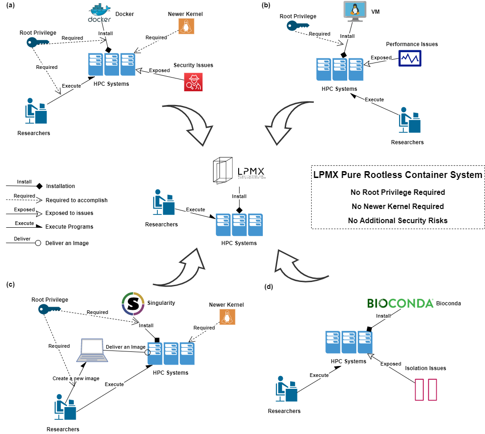

# LPMX     
LPMX, i.e, Local Package Manager X, is a pure rootless composable container system providing a chroot-like environment. It allows users to create Docker or Singularity (Experimental) images based containers and install packages inside containers without root/sudo privilege required. 

Below is a basic demo of using LPMX:

# Features
1. **Pure rootless**, root privilege(root/sudo) is not required in any stages. It runs completely inside user space, which is especially suitable for creating and running software in a restricted environment such as Linux cluster, grid infrastructure, batch system and etc, where root privilege is not approved.
2. **Understanding docker meta-data(Limited distros)**, LPMX could create containers via Docker images available on docker hub. Currently ubuntu and centos series are supported. Besides, the latest release also has experimental support for the Singularity image, see wiki for more details.
3. **Userspace union file system(UUFS)**, LPMX implements its own simple userspace union file system, creating a union mount for different layers containing directories and files from different locations and forming a single coherent file system. Unlike other existing implementations, i.e, fuse, overlay and etc, our userspace UFS does not require any pre-installation or bring modifications to host OS. It purely runs inside the userspace and can load Docker (Singularity) images without merging all layers. (This allows the system to share layers among different container instances without repeatedly uncompressing layers to establish root filesystem so the speed of creating containers will be fast!)
4. **Composability**, traditional container systems(Docker, Singularity, Podman) do not provide efficient communication channels for applications running on host and containers. For example, 'app A' running inside a container could not directly make a call to 'app B' running on host OS. However, LPMX is designed to provide this feature, which makes communication among applications running in different runtime environments become possible.
5. **Dynamic management of environmental variables**, LPMX allows end-users to set environment variables dynamically without stopping containers, all settings come into effect immediately.
6. **Designed for restricted runtime environment**, LPMX is designed for running containers in restricted runtime environments, such as root privilege is not approved or complete off-line usage. LPMX supports complete off-line initialization and deployment, which is especially suitable for scientific computing infrastructure.

A graphic abstract shows differences between our system and other existing implementations.

The root differences between our system and other rootless systems via using the LD_PRELOAD mechanism are that:
1. Our system supports composability, i.e, can isolate processes while allows them to make direct calls (exec) to other processes in the host or in other containers, therefore, eliminating the dependency hell issues.
2. A Userspace Union Filesystem (UUFS) allows to mount images from Docker (Singularity) images without merging all layers and losing metadata. Therefore, each time when creating containers all read-only layers are shared while only a read-write layer is created to represent the modifications of file manipulation.
3. Our system supports multiple image formats, including Docker and Singularity images, which allows end-users to create containers based on multiple existing image formats.

See [wiki](https://github.com/JasonYangShadow/lpmx/wiki) for more details.

# Examples
- Download and run newer ubuntu distros(ubuntu 14.04/16.04/18.04) on the host with old OS, such as centos 6, then install and run newer software inside.
- Package and deliver the current created environment to another machine.
- Run programs inside a container, and then make a direct call to other programs on the host.
- Get access to GPGPU resource easily by setting environment variables inside containers (/dev, /sys of the host are directly exposed to containers by default)

# Quick Run
1. check out [release page](https://github.com/JasonYangShadow/lpmx/releases)
2. chmod a+x Linux-x86_64-lpmx && ./Linux-x86_64-lpmx init

# Compile LPMX 
1. Make sure golang and [dep](https://github.com/golang/dep) are installed on your OS
2. go get -v github.com/jasonyangshadow/lpmx
3. cd $GOPATH/src/github.com/jasonyangshadow/lpmx
4. ./build.sh

If there are any dependencies issues, try to execute 'dep ensure' inside the project folder and then add vendor subfolder into $GOROOT var.

# Compile Fakechroot
LPMX uses [customized fakechroot](https://github.com/jasonyangshadow/fakechroot) for trapping glibc functions(open, mkdir, symlink and etc), if you want to compile fakechroot, please refer this [Wiki](https://github.com/JasonYangShadow/lpmx/wiki#9-compile-fakechroot-and-its-dependencies-from-scratch)

# Important Notice

**Only several host OS and Docker images are supported currently**

Basically, LPMX supports centos/redhat (5.7, 6.7, 7) and ubuntu (12.04, 14.04, 16.04, 18.04, 19.04) as host OS. 

For more information please refer the project's wiki page. 

# Related Projects

- [Fakechroot](https://github.com/JasonYangShadow/fakechroot)
- [LPM](https://lpm.bio/)
- [udocker](https://github.com/indigo-dc/udocker)
