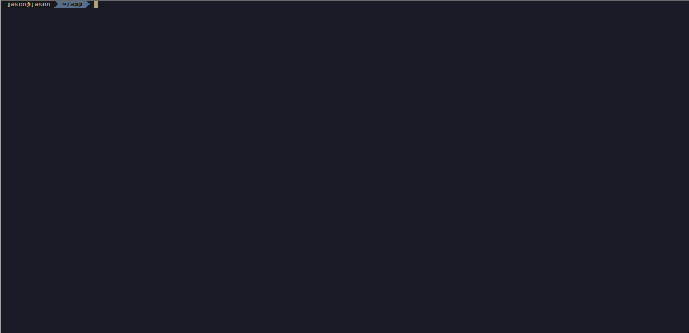
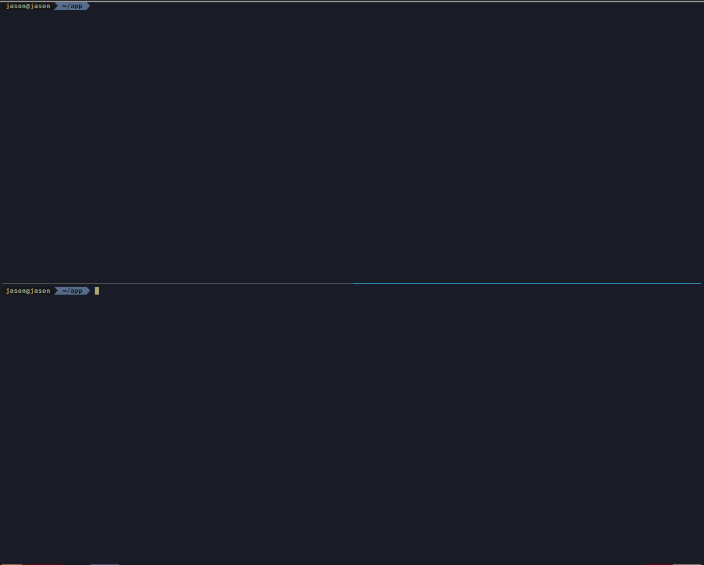
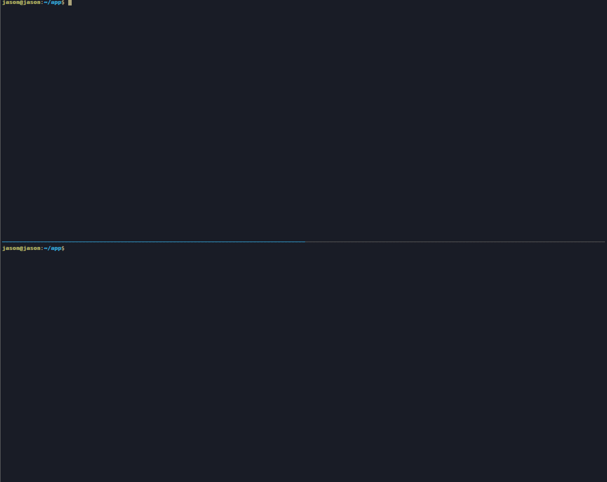
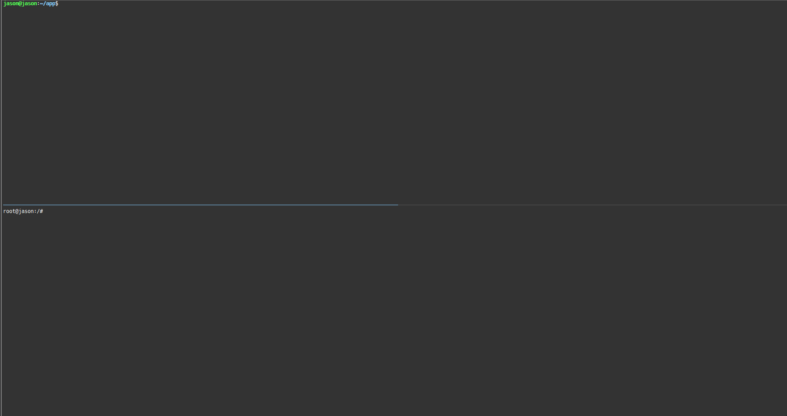

# LPMX       
LPMX, i.e, Local Package Manager X, is a pure rootless and composable container system.

# Feature
1. **Pure rootless**, root privilege(root/sudo) is not required in any stage. It runs completely inside user space, which is especially suiable for running containers in restricted environment such as Linux cluster, grid infrastructure, batch system and etc, where root privilege is not approved.
2. **Understanding docker metadata**, LPMX could create containers via docker images available on docker hub.
3. **Fake union file system(Fake Unionfs)**, LPMX implements its own simple rootless union file system, creating a union mount for different layers containing directories and files from differnt locations and forming a single coherent file system. Unlike existing implementations, i.e, fuse, overlay and etc, Fake Unionfs does not need pre-installation and modification on host OS.
4. **Composability**, traditonal container systems do not provide efficient communication channels for applications running on host and containers. For example, 'app A' running inside container could not directly make a call to 'app B' running on host OS. However, LPMX is designed to provide this feature, which makes communication among applications running in different runtime environments become possible.
5. **Dynamic management of environmental variables**, LPMX allows end-users to set environment variables dynamically without stopping containers, all settings come into effect immediately.
6. **Designed for restricted runtime environment**, LPMX is designed for running containers in restricted runtime environments, such as root privilege is not approved or complete offline usage. LPMX supports complete offline initialinzation and deployment, which is especially suitable for scientific computing infrastructure.
  
# Examples with LPMX
- Download and run containerized ubuntu 18.04 on old Linux OS on HPC, such as centos 5, then run programs with latest libraries available.
- Create and run containerized ubuntu system locally, install any software inside, package and copy tar files to another machine with network access limited, then you get everything work as locally.
- Run pipelines inside container, then make a call to host programs as you wish.
- Install software inside container, expose them to host and call them as you wish.
- Dynamically modify file path for loading data, open any files in any places through one unique file path.

# Quick run
1. check out [release page](https://github.com/JasonYangShadow/lpmx/releases)
2. chmod a+x lpmx && ./lpmx init

For bash users, 'source ~/.bashrc' will add lpmx folder to PATH env

# Compile LPMX from source code 
1. Make sure golang and [dep](https://github.com/golang/dep) are installed on your OS
2. go get -v github.com/jasonyangshadow/lpmx
3. cd $GOPATH/src/github.com/jasonyangshadow/lpmx
4. ./build.sh

If there are any dependencies issues, try to execute 'dep ensure' inside project folder and then add vendor subfolder into $GOROOT var.

# Compile Fakechroot from source code
LPMX uses [customized fakechroot](https://github.com/jasonyangshadow/fakechroot) for trapping glibc system calls, if you want to compile fakechroot, please refer [Wiki](https://github.com/JasonYangShadow/lpmx/wiki)

# How to use it
- ### Download and Initialize

    If you have network connection, only one binary program 'lpmx' is required, for end-users working under restricted network envrionments 'lpmx' and its dependency tarball are required, for details please check [Wiki](https://github.com/JasonYangShadow/lpmx/wiki)

- ### Search docker images and Download

    You could search both public and private docker images on docker hub.(Searching private images requires authentication)

- ### Create containers and Management

    You could create pure rootless containers based on downloaded docker images and manage their lifecycles using LPMX.
  

- ### Directly make a call to host application inside container

    Advanced feature such as directly making a call to host application is also easy to achieve, just set environment var 'EXCLUDE_EXE' e.g. export EXCLUDE_EXE=/usr/bin/nano, inside containers. See detail in [Wiki](https://github.com/JasonYangShadow/lpmx/wiki).

- ### Directly make a call to container application from host

    Advanced feature such as directly making a call to containerized application is also easy to achieve, just exit container and use 'lpmx expose' command.See detail in [Wiki](https://github.com/JasonYangShadow/lpmx/wiki).

- Dynamically manage environment variables to achieve advanced function

    LPMX also supports dynamically setting envrionment variables through embedded memcache server with immediate effect. 

# Related projects
- [Fakechroot](https://github.com/JasonYangShadow/fakechroot)
- [LPM](https://lpm.bio/)
- [udocker](https://github.com/indigo-dc/udocker)
